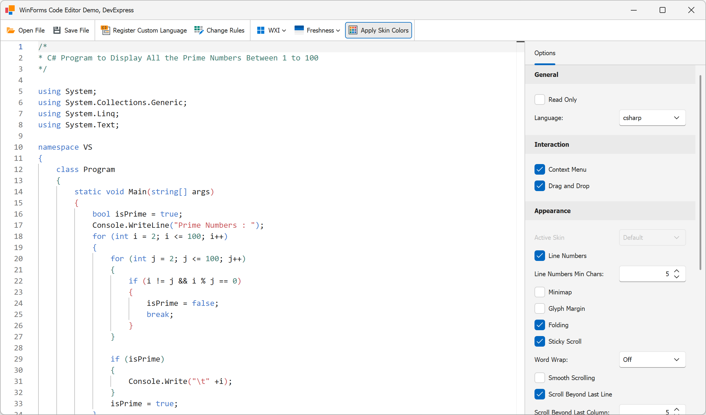

<!-- default badges list -->

[](https://supportcenter.devexpress.com/ticket/details/T1328656)
[](https://docs.devexpress.com/GeneralInformation/403183)
[](#does-this-example-address-your-development-requirementsobjectives)
<!-- default badges end -->
# WinForms Monaco-Based Code Editor

> [!Note]
> The WinForms `CodeEditor` control is available as part of this example. It is not included in the DevExpress WinForms UI distribution.

This example wraps the open source [Monaco Editor (v0.55.1)](https://github.com/microsoft/monaco-editor). The editor is hosted inside Microsoft WebView2 and exposed through a reusable `CodeEditor` WinForms control.



## Prerequisites

- .NET 8+
- Microsoft WebView2 Runtime
- Windows

## Features

The `CodeEditor` control exposes properties that map directly to Monaco Editor settings and can be configured at runtime.

Features include:

- 50+ Built-in Languages
- DevExpress Skin Integration
- Theme Token Rule Editor
- Configurable Editor Options (line numbers, minimap, folding, word wrap, and more)
- Track Changes
- Read-Only Mode
- Load/Save Files

### Content and State

- `Text` — Specifies editor content
- `ReadOnly` — Enables read-only mode
- `IsModified` — Indicates whether unsaved changes exist

```csharp
codeEditor.Text = "public class Demo { }";
codeEditor.ReadOnly = false;
bool isModified = codeEditor.IsModified;
```

### Language

The `CodeEditor` control supports 50+ built-in languages (C#, JavaScript, Python, SQL, XML, JSON, and more) and allows you to register custom programming languages as needs dictate.

```csharp
// Specify a programming language using a Monaco language identifier.
// For example, csharp, javascript, python, sql, json, etc.
codeEditor.EditorLanguage = "csharp";
```

Use the `RegisterLanguage` method to add a new language definition:

```csharp
codeEditor.RegisterLanguage(new LanguageDescriptor {
    Id = "myLang",            // Unique language identifier
    Monarch = "...",          // Tokenizer definition
    Configuration = "..."     // (optional) Language configuration
});
```

The `Monarch` property must contain a valid Monaco Monarch tokenizer definition provided as a JavaScript object literal.

Example:

```csharp
var language = new LanguageDescriptor {
    Id = "simpleLang",
    Monarch = @"
{
    tokenizer: {
        root: [
            [/[a-z_$][\w$]*/, 'identifier'],
            [/\d+/, 'number'],
            [/"".*?""/, 'string']
        ]
    }
}",
    Configuration = @"
{
    comments: {
        lineComment: '//'
    }
}"
};

codeEditor.RegisterLanguage(language);
```

### Appearance and Themes

```csharp
codeEditor.ShowLineNumbers = true;
codeEditor.ShowMinimap = true;
codeEditor.ShowGlyphMargin = false;

codeEditor.ApplyDevExpressColors = true;
```

### Smooth Scrolling and Layout

```csharp
codeEditor.EnableSmoothScrolling = true;
codeEditor.EnableScrollBeyondLastLine = true;
codeEditor.ScrollBeyondLastColumn = 5;
codeEditor.EnableStickyScroll = true;
codeEditor.LineNumbersMinChars = 5;
codeEditor.TabSize = 4;
```

### Editing

```csharp
codeEditor.InsertSpaces = true;
codeEditor.DetectIndentation = true;
codeEditor.AutoIndent = EditorAutoIndent.Full;
codeEditor.WordWrap = EditorWordWrap.On;

// IntelliSense and suggestions
codeEditor.EnableQuickSuggestions = true;
codeEditor.EnableWordBasedSuggestions = true;
codeEditor.EnableSuggestOnTriggerCharacters = true;
codeEditor.EnableParameterHints = true;
```

### Interaction

- Context Menu
- Drag and Drop
- Zoom (`Ctrl` + mouse wheel)

```csharp
codeEditor.EnableContextMenu = true;
codeEditor.EnableDragAndDrop = true;
codeEditor.EnableMouseWheelZoom = false;
```

## Implementation Details

### Architecture

The `CodeEditor` control hosts the Monaco Editor inside a WebView2 instance and exposes it as a reusable WinForms component.

```csharp
public class CodeEditor : XtraUserControl, IEditorMessageHandler {
    WebView2? webView;
    IEditorCommandChannel commandChannel = null!;
    EditorMessageDispatcher messageDispatcher = null!;

    public CodeEditor() {
        webView = new WebView2 {
            Dock = DockStyle.Fill
        };
        commandChannel = new WebView2CommandChannel(webView);
        messageDispatcher = new EditorMessageDispatcher(this);
        Controls.Add(webView);
        LookAndFeel.StyleChanged += LookAndFeel_StyleChanged;
        Rules = new List<MonacoThemeRule>();
    }
}
```

### Communication Model

All interaction between C# and Monaco is handled via JSON messages over WebView2.

```csharp
public void Send(EditorCommandType type, object? payload = null) {
    if(!IsReady)
        return;

    var cmd = new EditorCommand {
        Type = type,
        Payload = payload
    };

    var options = new JsonSerializerOptions(JsonSerializerOptions.Web);
    string json = JsonSerializer.Serialize(cmd, options);
    webView?.CoreWebView2?.PostWebMessageAsJson(json);
}
```

Incoming messages:

```csharp
public void HandleWebMessageReceived(object? sender, CoreWebView2WebMessageReceivedEventArgs e) {
    if(sender is not CoreWebView2)
        return;

    EditorMessage? message;
    try {
        message = JsonSerializer.Deserialize<EditorMessage>(e.WebMessageAsJson, JsonSerializerOptions.Web);
    }
    catch { return; }

    if(message?.Type == null)
        return;

    switch(message.Type) {
        case EditorMessageType.TextChanged:
            handler.OnTextChanged(message.Payload.GetString() ?? string.Empty);
            break;
        case EditorMessageType.EditorReady:
            handler.OnEditorReady();
            break;
        case EditorMessageType.IsDirtyChanged:
            handler.OnIsModifiedChanged(message.Payload.GetBoolean());
            break;
        case EditorMessageType.Languages:
            List<string> langs = message.Payload
                .EnumerateArray()
                .Select(x => x.GetString()!)
                .ToList();
            handler.OnLanguagesReceived(langs);
            break;
    }
}
```

### State Management

All properties are restored after initialization:

```csharp
void ApplyCurrentState() {
    RestoreRegisteredLanguages();

    SetEditorLanguage(EditorLanguage);
    SetWordWrap(WordWrap);
    SetTheme(ThemeName);
    SetAutoIndent(AutoIndent);
    commandChannel.Send(EditorCommandType.SetReadOnly, ReadOnly);
    commandChannel.Send(EditorCommandType.SetText, Text);

    EditorOptionHelper.SendOption(commandChannel, EditorOption.LineNumbers, ShowLineNumbers);
    EditorOptionHelper.SendOption(commandChannel, EditorOption.Minimap, ShowMinimap);
    EditorOptionHelper.SendOption(commandChannel, EditorOption.Folding, EnableFolding);
    EditorOptionHelper.SendOption(commandChannel, EditorOption.TabSize, TabSize);
    EditorOptionHelper.SendOption(commandChannel, EditorOption.InsertSpaces, InsertSpaces);
    //...
}
```

### Editor Configuration

`CodeEditor` options are exposed as public properties:

```csharp
//codeEditor.ShowLineNumbers = true;

public bool ShowLineNumbers {
    get => showLineNumbers;
    set {
        if(showLineNumbers == value) return;
        showLineNumbers = value;
        EditorOptionHelper.SendOption(commandChannel, EditorOption.LineNumbers, value);
    }
}
```

### Programming Language Support

The `CodeEditor` supports both built-in and custom languages.

```csharp
public void RegisterLanguage(LanguageDescriptor language) {
    if(language == null)
        throw new ArgumentNullException(nameof(language));

    var payload = new {
        id = language.Id,
        monarch = language.Monarch,
        configuration = language.Configuration
    };
    commandChannel.Send(EditorCommandType.RegisterLanguage, payload);
    registeredLanguages[language.Id] = language;
}
```

### Track Changes

The editor tracks unsaved changes:

```csharp
codeEditor.IsModifiedChanged += (s, e) => {
    saveItem.Enabled = codeEditor.IsModified;
};
```
<!-- feedback -->
## Does This Example Address Your Development Requirements/Objectives?

[](https://www.devexpress.com/support/examples/survey.xml?utm_source=github&utm_campaign=winforms-code-editor-demo&~~~was_helpful=yes) [](https://www.devexpress.com/support/examples/survey.xml?utm_source=github&utm_campaign=winforms-code-editor-demo&~~~was_helpful=no)

(you will be redirected to DevExpress.com to submit your response)
<!-- feedback end -->
